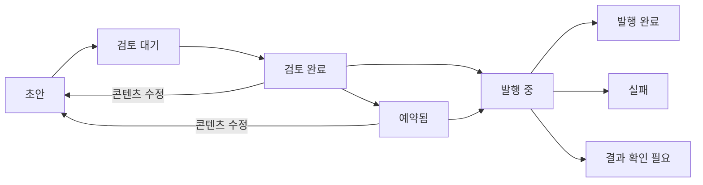

# 화면 구성과 사용자 흐름

작성: 2026-09-25 · 기본안 · 아직 화면을 구현하지 않음

## 정보 구조

```text
Nullge Console
├─ 전체 보기                 오늘 일정 / 검토 대기 / 실패 / 연결 조치
├─ 제품
│  └─ mellow · ClipIt · minimo · desk · 새 제품
│     ├─ 마케팅             콘텐츠 목록 / 편집 / 캠페인 필터
│     ├─ 일정               주간 보기 / 목록 / 시간대
│     ├─ 미디어             업로드 / 미리보기 / 사용 중인 게시물
│     ├─ 제품·브랜드         제품 사실 / 근거 / 말투 / 시각 자료 / 링크
│     └─ 채널·설정           SNS 계정 / 연결 상태 / 생성 한도 / 발행 중지
└─ 운영 설정                운영자 / 생성 공급자 / 전체 사용량 / 작업 이력
```

마케팅이 첫 운영 기능이다. 추가 모듈을 위한 빈 메뉴는 만들지 않는다. 전역 화면에는 제품명이 항상 나오고, 제품 내부 화면에는 선택한 제품과 작성 중인 콘텐츠의 소속을 고정 표시한다.

## 1. 제품 등록

1. 제품 이름과 한 줄 설명을 입력한다. 이름만으로 비어 있는 초안 제품을 만들 수 있다.
2. 핵심 기능·고객층·언어·말투·소개 링크를 채운다. 각 기능의 근거와 확인 상태를 기록한다.
3. 로고·스크린샷·참고 이미지를 등록하고 활용할 수 있는 자료임을 확인한다.
4. 프로필을 검토 완료로 저장한다. AI 기획은 검토된 프로필이 있어야 시작할 수 있다.
5. SNS 계정을 연결한다. 연결 없이도 수동 초안·편집·복사·파일 다운로드를 사용할 수 있다.

출시 상태·가격·대상 고객이 비어 있어도 임의로 추정해 채우지 않는다. 새 제품을 등록하는 과정에서 다른 제품의 SNS 계정이나 발행 허용 설정을 상속하지 않는다.

## 2. 콘텐츠 제작

제품 선택 → 새 콘텐츠 → 채널·언어·목표·소재 지정 → 직접 작성 또는 AI 초안 → 편집 → 검토.

편집 화면에서 항상 볼 정보:

| 위치 | 정보 |
| --- | --- |
| 상단 | 제품, 채널, 선택 계정, 저장 상태, 콘텐츠 상태 |
| 본문 | 제목, 목표, 문구, 미디어, 캠페인, 실제 목적지 링크 |
| 보조 영역 | 채널별 미리보기, 길이·형식 검사, 제품 사실 확인 결과 |
| 하단 | 저장, 문구 복사, 파일 다운로드, 검토 완료, 예약/즉시 발행 |

AI 작업은 비동기로 진행한다. 화면을 닫아도 작업 ID로 결과를 찾을 수 있다. 생성 중 사용자가 수정했다면 늦게 도착한 결과를 본문에 덮어쓰지 않고 별도 결과로 남긴다. 채널 변형은 원본을 유지한 새 게시물로 만든다.

다른 제품으로 전환할 때 저장되지 않은 내용은 저장하거나 유지 여부를 선택할 수 있게 한다. 제품 전환만으로 기존 글의 소속이 바뀌지 않는다. 다른 제품으로 복제하는 기능은 첫 버전에 포함하지 않는다.

## 3. 검토와 예약

검토에는 실제 문구·미디어·링크와 발행 계정이 포함된다. AI 검사 결과, 사용한 제품 프로필 버전, 검토 이후 변경 여부를 보여준다.

예약 패널에는 `제품 / 채널 / @계정 / 시각 / 시간대 / 콘텐츠 미리보기`를 한 번에 표시한다. 기본 시간대는 Asia/Seoul이고 데이터는 UTC로 저장한다. 과거 시각을 입력하면 바로 발행으로 바꾸지 않고 다시 고르게 한다.

예약 시 서버가 계정 소속·권한·연결 상태·발행 허용·콘텐츠 버전·파일 형식을 검사한다. 실패하면 초안을 보존하고 원인과 필요한 조치를 표시한다. 예약 뒤 본문·미디어·링크·계정을 수정하면 기존 예약과 승인을 해제한다. 시간만 바꿀 때는 동일 콘텐츠 버전을 유지하며 별도 이력을 남긴다.

즉시 발행도 같은 검사를 거치고 비동기 작업으로 처리한다. 버튼이 눌렸다는 이유로 발행 완료를 표시하지 않는다.

## 4. 상태 표시



미디어 생성 중·업로드 중 등 실행 세부 상태는 작업 패널에 표시한다. 본문의 콘텐츠 상태와 실행 상태를 한 문자열에 모두 넣지 않는다. 이 그림은 주 흐름이며 취소·직접 게시 상태는 아래 규칙을 따른다.

| 상황 | 표시와 조치 |
| --- | --- |
| 검토 전 초안 | 편집·취소 가능. 자동 발행 없음 |
| 예약 취소 | 글을 보존하고 검토 완료로 복귀. 실행 직전 경쟁은 서버에서 제어 |
| 보관/취소 | 이후 실행을 막되 이력과 외부 결과는 보존 |
| 계정 만료 | 재연결 필요. 예약은 차단되며 재연결만으로 밀린 글을 즉시 발행하지 않음 |
| 확정 실패 | 원인 수정 후 새 시도로 재예약. 공급자가 수락하지 않았다는 근거가 필요 |
| 결과 확인 필요 | 외부에 올라갔는지 확인. 확인 전 자동 재시도 없음 |
| 직접 게시 | 사용자가 외부 링크·시각을 기록. `직접 게시 · 운영자 기록`으로 표시 |

서비스가 중단된 동안 지나간 예약은 재시작 후 검토 대상으로 돌린다. 연체된 콘텐츠를 일괄 발행하지 않는다. 허용 지연 시간은 구현 때 정하고 화면과 테스트에 같은 기준을 사용한다.

## 5. 연결 상태

`미연결 → 계정 확인됨 → 권한 확인됨 → 실발행 검증됨`을 서로 다른 증거로 표시한다. 공급자가 전체 권한 조회를 지원하지 않으면 확인 불가로 남긴다. 발행 허용은 연결 검증과 별도 스위치이며 초기값은 꺼짐이다.

워크스페이스의 공급자 앱 설정과 제품의 실제 SNS 계정을 구분한다. API 키 저장 성공을 유료 잔액 확인이나 이미지 생성 성공으로 표현하지 않는다.

전체 중지와 제품별 중지를 제공한다. 중지는 아직 시작하지 않은 작업과 이후 발행을 막는다. 이미 공급자가 수락한 게시물을 삭제하거나 생성 비용을 환불하는 기능은 아니다.

## 화면 검증 기준

- 전체 보기에서 제품 두 개를 섞어 보여도 모든 콘텐츠·계정·사용량의 소속이 식별된다.
- 연결 전에도 제품 등록 → 초안 저장 → 복사·다운로드까지 막힘이 없다.
- 저장 충돌, 토큰 만료, 지연 응답, 결과 불명 상황에서 입력과 상태를 잃지 않는다.
- 데스크톱에서 제작하고 모바일에서 검토·예약할 수 있다. 키보드 탐색, 폼 레이블, 색상 외 상태 구분을 제공한다.
- 빈 목록에는 첫 행동을, 로딩 중에는 진행 상태를, 미수집 지표에는 미수집을 표시한다.

관련 문서: [데이터 구조](03-architecture.md), [구현과 검증](05-delivery-plan.md).
