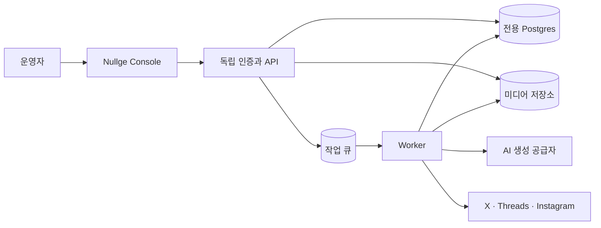

# 데이터와 시스템 구조

작성: 2026-09-25 · 전체 구현 기본안. 현재 구현 범위는 08 문서, Railway 운영 설정은 09 문서를 기준으로 한다.

## 저장소와 배포 경계

같은 저장소에서 공개 회사 사이트와 내부 Console을 관리하되, 실행 환경은 분리한다. 기존 회사 사이트 파일은 첫 구현에서 이동하지 않는다.

```text
nullge/
├─ index.html · styles.css · assets/    기존 회사 소개 사이트
├─ .github/workflows/pages.yml         DNS 전환 전 보존한 기존 배포
├─ docs/marketing/                     현재 기획 문서
├─ apps/site/                          공개 정적 사이트 Railway 서버
├─ apps/console/                       내부 운영 웹
├─ apps/api/                           인증·제품·초안·검토 API
├─ apps/worker/                        상태 신호만 구현; 발행은 미구현
├─ packages/contracts/                 요청·응답·검증 규칙
├─ packages/database/                  데이터 모델·마이그레이션
└─ packages/marketing/                 예정: 채널 어댑터·기획·발행 정책
```

`packages/marketing`과 큐·미디어 저장소는 아직 없다. 새 코드는 인접한 mellow 저장소를 런타임 의존성으로 참조하거나 심볼릭 링크로 연결하지 않는다.

현재 TypeScript, pnpm workspace, Next.js Console, NestJS API, Node Worker, TypeORM·Postgres를 사용한다. Redis·BullMQ는 예약 발행 구현 시 추가할 계획이다. 아래 그림은 전체 목표 구조이며 아직 없는 구성요소를 포함한다.



제품들의 DB와 고객 로그인은 이 흐름에 들어오지 않는다. 제품 정보와 홍보 자료를 수동 등록하는 방식으로 시작한다. 추후 제품 연동은 명시적인 API·파일 가져오기 경계로 추가한다.

## 인증과 권한

기본안은 Google 로그인과 서버 측 운영자 허용 목록이다. 공개 가입은 제공하지 않는다. 최초 허용 계정 확인 후 공급자의 안정적인 사용자 식별자로 귀속하며, 검증되지 않은 이메일 문자열만으로 권한을 주지 않는다. 실제 계정과 OAuth 앱·콜백 주소는 구현 시 설정한다.

로그인 세션은 HttpOnly 쿠키로 관리하고 변경 요청에 출처/CSRF 검사를 적용한다. 제품 관리자 토큰을 가져오거나 mellow의 관리자 DB를 조회하지 않는다. 초기에는 `Workspace=Nullge`, `Membership=owner`만 필요하며 팀 초대·역할 편집 UI는 만들지 않는다.

API는 URL의 프로젝트 ID만 믿지 않고 세션의 작업공간 권한과 객체 소속을 확인한다. Worker도 작업에 기록된 작업공간·제품·계정의 관계를 다시 확인한다. 내부 사용자 1명이어도 제품이 섞이지 않는 검사는 필수다.

## 주요 데이터 모델

아래는 개념 설계이며 SQL이나 확정된 API 스키마가 아니다.

| 모델 | 핵심 정보 | 소속·관계 |
| --- | --- | --- |
| Workspace / Membership | 이름, 운영자, 전체 중지 | Nullge 1개로 시작 |
| Project | 이름, slug, 기본 언어·시간대, 보관 상태, 발행 중지 | workspaceId |
| ProjectProfileVersion | 제품 사실·근거·확인일, 말투, 시각 규칙, 링크, 검토 상태 | workspaceId + projectId, 불변 버전 |
| ProviderApp | SNS OAuth 앱 설정, 생성 공급자 설정, 암호화 키 버전 | workspaceId, 제품 계정과 분리 |
| ChannelAccount | 공급자, 외부 계정 ID, 표시명, 연결 세대, 권한·만료·검증 증거 | workspaceId + projectId |
| Campaign | 이름, 목표, 기간 | workspaceId + projectId, 게시물에서 선택적으로 참조 |
| Post | 제목, brief, 언어, 채널, 본문, 미디어, revision, 상태 | workspaceId + projectId + campaignId? |
| Approval | 본문·미디어·링크 digest, 계정·연결 세대, 프로필 버전, 검토자·시각 | 특정 Post revision |
| Publication | 승인 revision, 대상 계정, 예정 시각, 실행 상태, 외부 결과 | workspaceId + projectId + postId |
| PublicationAttempt | 요청 의도, 요청 ID, 응답, 확인 필요 사유 | publicationId, 시도별 append-only 기록 |
| Asset | 원본 파일, MIME·크기·checksum, 생성/업로드 출처, 저장 위치 | workspaceId + projectId |
| GenerationJob / Usage | 작업·모델·프롬프트·프로필 버전, 입력 revision, 사용량·비용 추정 | workspaceId + projectId + postId? |
| Event | 행동, 행위자, 시각, 변경 전후 요약 | workspaceId + projectId?, 대상 객체 참조 |
| Outbox | 큐에 전달할 작업, 중복 방지 키, 전달 상태 | workspaceId + projectId |

게시물은 한 채널용이며 첫 버전의 미디어 첨부는 한 파일이다. 채널별 복제 게시물은 선택적 그룹 ID로만 묶는다. 발행 이력은 본문 편집과 독립적으로 보존한다. 예약 시간 변경은 같은 승인 버전의 Publication을 갱신하고 revision과 이벤트를 남긴다.

첫 버전에는 SNS 계정 하나를 한 제품에 귀속한다. 같은 작업공간에서 `(provider, externalAccountId)`를 중복 연결하면 기존 제품을 알리고 차단한다. Nullge 공용 계정을 여러 제품에 공유하는 흐름은 별도 기획 후 매핑 모델로 확장한다. 제품별 여러 계정을 저장할 수 있되 게시물에는 실제 한 계정을 명시해야 한다.

계정 교체·재연결은 연결 세대를 올리고 기존 예약의 승인 상태를 다시 확인하게 한다. 같은 계정의 정상적인 자동 토큰 갱신은 연결 세대 변경과 구분한다.

## 데이터가 섞이지 않게 하는 조건

- 모든 목록·검색·최근 콘텐츠·미디어 조회·사용량 집계에 작업공간과 제품 범위를 적용한다.
- 외래 키/복합 유일 키로 게시물·캠페인·미디어·계정이 같은 제품에 속함을 검증한다. UI 필터만으로 보장하지 않는다.
- 조회·수정·다운로드·예약·콜백에서 다른 제품의 ID를 넣는 테스트를 둔다.
- 승인 스냅샷과 실제 발행 직전의 revision·계정·연결 세대·중지 상태를 비교한다.
- 제품 프로필 변경은 기존 생성 결과를 덮지 않는다. 이전 버전 승인/예약은 재검토 대상으로 전환하고 발행을 막는다.
- 제품 보관 시 신규 기획과 예약 발행을 막고 미처리 예약을 취소한다. 과거 발행 결과와 작업 이력은 유지한다.

## 작업 실행과 복구

Postgres에 작업 상태와 외부 요청 의도를 영속적으로 저장하고, BullMQ는 실행을 깨우는 용도로 쓴다. API 트랜잭션에서 상태 변경과 Outbox를 함께 저장하며, 전달기는 동일 키로 큐를 갱신한다. 큐 메시지만으로 발행 권한이 생기지 않는다.

Worker는 작업 단위 lease·revision으로 중복 실행을 막는다. lease 만료 후 이전 Worker의 늦은 응답이 새 상태를 덮지 못하게 한다. 한 제품의 긴 미디어 생성이 전체 제품을 막지 않도록 제품별 동시 실행 제한과 순환 처리를 둔다. 기존 전체 작업용 고정 advisory lock을 그대로 복사하지 않는다.

발행 요청 전에 PublicationAttempt에 요청 의도를 남긴다. 외부 공급자가 요청을 수락했을 가능성이 있는 timeout/프로세스 중단은 `결과 확인 필요`로 둔다. 공급자가 제공하는 안전한 조회·중복 방지 기능으로 결과를 확인할 수 있는 경우에만 복구하고, 확인되지 않은 POST를 반복하지 않는다. 외부 API를 포함한 exactly-once를 보장한다고 표현하지 않는다.

내부 잠금은 네트워크 호출 전후의 상태 전이에 사용하고 긴 트랜잭션으로 외부 호출을 감싸지 않는다. 마지막 확인 이후 이미 전송된 외부 요청은 중지 버튼으로 취소할 수 없으므로 시점과 결과를 기록한다.

토큰 만료·권한 변경·전체 중지·프로필 변경·오래 지연된 예약은 작업을 차단하고 사용자 조치를 기다린다. 재연결이나 재시작을 밀린 게시물의 일괄 발행 동의로 취급하지 않는다.

## 채널 연결과 자격 증명

공급자 앱 자격 증명은 작업공간에, 계정 토큰은 제품별 ChannelAccount에 둔다. 암호화된 값은 키 버전과 귀속 정보를 포함하며 로그·브라우저 응답에 노출하지 않는다. 새 서비스용 암호화 키를 마련한다.

OAuth state는 로그인 사용자·작업공간·제품·공급자·목적 계정/연결 요청에 묶고 일회성·만료를 검사한다. PKCE verifier는 서버에서만 보관한다. 콜백 때 브라우저에서 선택한 다른 제품에 계정이 저장되지 않도록 요청 당시의 소속을 사용한다.

기존 코드의 Instagram/Threads 토큰 입력은 전환기 운영자 전용 경로로 유지할 수 있다. 입력한 토큰의 실제 계정과 지원 권한을 검증하며 완성된 OAuth 온보딩처럼 표시하지 않는다. Meta OAuth 개선은 플랫폼 등록 상태와 실제 계정으로 검증한 뒤 추가한다.

X는 기존 PKCE 구현이 재사용 대상이다. 새 호스트의 콜백 등록·사용자 재연결은 별도 작업이며, 기존 연결 성공만으로 새 서비스에서 작동한다고 가정하지 않는다. [X 공식 OAuth 문서](https://docs.x.com/fundamentals/authentication/oauth-2-0/authorization-code).

## 미디어와 사용량

첫 구현 기본안은 전용 S3 호환 저장소이며 Postgres에는 메타데이터와 checksum을 둔다. 로컬에서는 같은 인터페이스의 개발 저장소를 쓴다. 구체적인 호스팅·버킷은 미정이다. 초기 공통 업로드 상한은 기존 25 MB를 출발점으로 검토하고, 채널별 더 엄격한 형식·용량 제한을 별도로 적용한다.

일반 열람은 인증된 URL로 제공한다. 공급자가 파일을 가져가야 할 때만 유효기간이 있는 전달 URL을 발급하며 실제 수집 시간과 재시도 기간을 충족하는지 검증한다. 사용 중인 파일은 덮어쓰지 않고 새 자산으로 저장한다. 발행 중인 미디어를 삭제해 게시를 깨뜨리지 않는다.

확장자만으로 파일을 신뢰하지 않고 실제 형식을 확인한다. 생성 결과 URL은 허용된 공급자 호스트와 공개 네트워크 주소인지 검사한다. 임의 사이트 자동 수집은 첫 버전에서 제외한다.

생성 건수·동시 실행 한도는 요청 전 트랜잭션으로 예약하여 동시 요청에도 지킨다. 한도 일자는 제품 시간대를 기준으로 계산한다. 추정 비용과 확인된 사용량은 분리하고, 가격을 모르면 알 수 없음으로 표시한다. 공급자 청구 지연이 있으므로 내부 추정치를 절대적인 지출 보장으로 설명하지 않는다. 자동 충전은 범위 밖이다.

관련 문서: [mellow 이관](04-migration.md), [검증 항목](05-delivery-plan.md).
